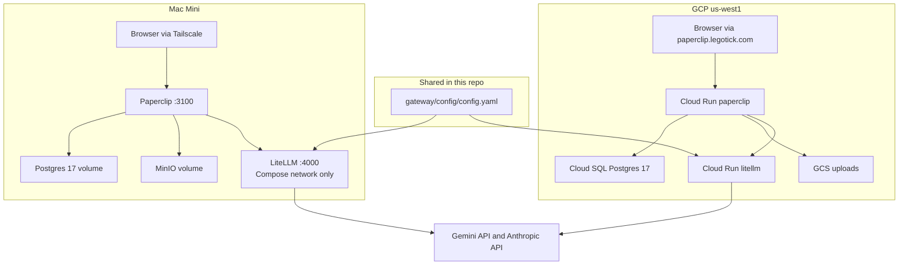

# Architecture

How this repo runs Paperclip, how an agent call reaches a model, and how `worker` / `reasoning` / `premium` are chosen. Deploy commands live in the [root README](README.md). The Mac Mini steps are in [`local/README.md`](local/README.md). GCP operations are in [`gcp/docs/runbook.md`](gcp/docs/runbook.md).

This repo does not contain Paperclip source. Both deploys run the published image `ghcr.io/paperclipai/paperclip:sha-e55d702` (v2026.722.0).

## What Paperclip is here

Paperclip is the control plane: a Node server, the React dashboard, Postgres, and an in-process heartbeat scheduler. Agents run as child processes inside the Paperclip container. There is one scheduler per process and no leader election, so each deploy runs a single Paperclip process. On GCP that is Cloud Run with one instance and CPU always allocated. On the Mini the machine has to stay awake.

The two deploys do not share a database, uploads, or secrets. Starting the Mini stack does not read Cloud SQL, GCS, or Secret Manager.

## Mac Mini

[`local/compose.yaml`](local/compose.yaml) runs four long-lived services. Project name `paperclip-local`.

| Service | Role | Persistence |
|---|---|---|
| `paperclip` | Dashboard and agents, host port 3100 | volume `paperclip-home` at `/paperclip` |
| `db` | Postgres 17 | volume `paperclip-postgres` |
| `minio` | Uploads through Paperclip's S3 storage provider | volume `paperclip-minio`, bucket `paperclip-uploads` |
| `litellm` | Model router. Port 4000 is on the Compose network only | image built from [`gateway/`](gateway/) |

Auth mode is `authenticated`, exposure `private`, bind `tailnet`. `PAPERCLIP_PUBLIC_URL` is the Tailscale MagicDNS URL. That value has to match the URL the browser opens, or login fails. Other computers join the same Tailscale network. The Mini does not port-forward port 3100.

## GCP

Terraform under [`gcp/infra/terraform`](gcp/infra/terraform) describes one environment, `dev`, in project `paperclip-ks-prod`, region `us-west1`. GitHub Actions applies it after Environment `dev` is approved. Actions authenticates with Workload Identity Federation. There is no service-account JSON key and no load balancer.

| Piece | Role |
|---|---|
| Cloud Run `paperclip` | 1 vCPU, 4 GiB, CPU always on, min = max = 1, request timeout 3600s. Migrations run on boot. Public URL `https://paperclip.legotick.com`. |
| Cloud Run `litellm` | 1 vCPU, 1 GiB, min instances 0. Every `/v1/*` call needs the LiteLLM master key. |
| Cloud SQL | PostgreSQL 17, private IP, zonal, backups and point-in-time recovery. Default tier `db-custom-1-3840`. |
| GCS | Uploads, reached with the S3-compatible XML API and an HMAC key. |
| Secret Manager | Database URL, auth and signing secrets, the secrets master key, the LiteLLM master key, and the provider keys. |
| Artifact Registry | Digest-pinned Paperclip and LiteLLM images. |
| Job `paperclip-auth-bootstrap` | Mints the first admin invite. Public mode does not allow a browser self-claim. |

Cloud Run reaches Cloud SQL on the private network. Calls to Gemini, Anthropic, and GitHub leave Cloud Run directly. There is no Cloud NAT.

## How a model call is routed

LiteLLM does not run a model. It forwards a name to a provider API. The only copy of that map is [`gateway/config/config.yaml`](gateway/config/config.yaml). The Mini builds it into the `litellm` container. GCP bakes the same file into the LiteLLM image (`ghcr.io/berriai/litellm:v1.76.1-stable`) and deploys that digest.

| Name the agent sends | Where LiteLLM sends it | When it is used |
|---|---|---|
| `worker` | `gemini/gemini-3.6-flash` | Default, cheap work |
| `reasoning` | `gemini/gemini-3.1-pro-preview` | Harder questions |
| `premium` | `anthropic/claude-sonnet-4-5` | Escalation only |
| `gemini-2.5-flash-lite`, `gemini-2.5-flash`, `gemini-3.6-flash` | `gemini/gemini-3.6-flash` | IDs the Gemini CLI and the `cheap` heartbeat profile send on their own |
| `gemini-2.5-pro` | `gemini/gemini-3.1-pro-preview` | Same, for the Pro id |

`gemini-2.5-*` names stay in the list because new Gemini API keys get a 404 for those models. LiteLLM rewrites them to the 3.x models above.

Provider keys live only on LiteLLM:

| Key | Mini | GCP |
|---|---|---|
| Gemini API key | `GEMINI_API_KEY` on the `litellm` service | Secret `litellm-gemini-api-key` |
| Anthropic API key | `ANTHROPIC_API_KEY` on the `litellm` service | Secret `litellm-anthropic-api-key`, mounted only after a version exists |
| LiteLLM master key | `LITELLM_MASTER_KEY` | Secret `litellm-master-key` |

Until the Anthropic secret has an enabled version, `premium` fails and `worker` / `reasoning` still work.

### Path from an agent to the provider

The pinned Paperclip image has no OpenAI-compatible chat adapter. The built-in `http` adapter is a webhook, so agents do not call LiteLLM with it. They use the Gemini CLI adapter, `gemini_local`, with engine `cli`.

1. The heartbeat scheduler, or a person in the dashboard, starts an agent run inside the Paperclip container.
2. The agent adapter is Gemini CLI. Paperclip sets `GOOGLE_GEMINI_BASE_URL` and `LITELLM_BASE_URL` to LiteLLM (`http://litellm:4000` on the Mini, the Cloud Run URL on GCP).
3. Paperclip's `GEMINI_API_KEY` is the LiteLLM master key, not the Google key. The CLI will not use that variable until [`settings.json`](local/gemini-cli/settings.json) selects `gemini-api-key`. On GCP the same JSON is mounted from Secret Manager at `/etc/gemini-cli/settings.json`. `GEMINI_CLI_TRUST_WORKSPACE=true` lets the CLI run headless.
4. The CLI sends the model name (`worker`, or a native id such as `gemini-2.5-flash-lite`) to LiteLLM with `Authorization: Bearer <master key>`.
5. LiteLLM looks up the name in `config.yaml` and calls Gemini or Anthropic with the provider key.
6. The reply returns on the same path. Paperclip records the run in Postgres.

In the dashboard, a test agent is set to adapter Gemini CLI, engine `cli`, model `worker` when the field accepts a custom name. Heartbeats that apply the built-in `cheap` profile send `gemini-2.5-flash-lite`; the alias row above covers that. Agents left on `claude_local` do not go through this router. On GCP those agents have no Anthropic key inside Paperclip, so that path is unused. Claude is reached only as `premium` through LiteLLM.

### Changing which model an alias uses

Edit `litellm_params.model` under that alias in `gateway/config/config.yaml`. Agent records stay on `worker` / `reasoning` / `premium`.

- Mini: `docker compose up -d --force-recreate litellm` from `local/`.
- GCP: dispatch `gateway-build`, merge the digest pin, approve Environment `dev`.
